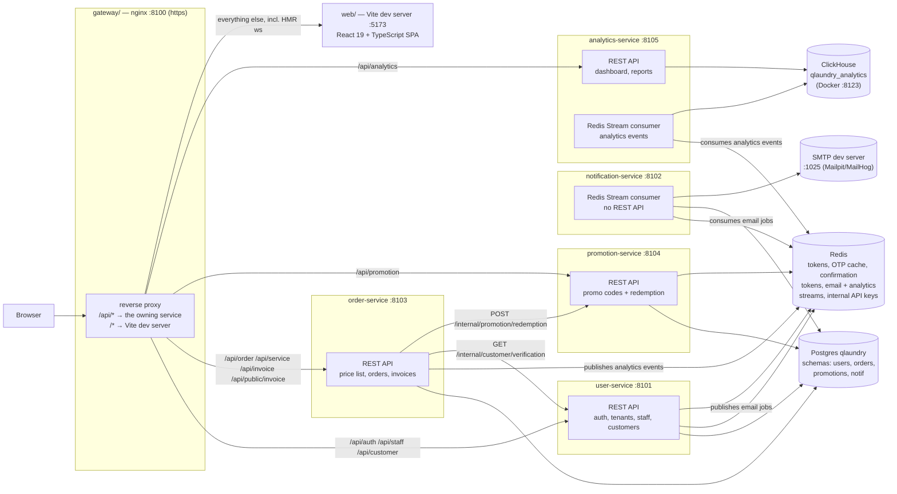
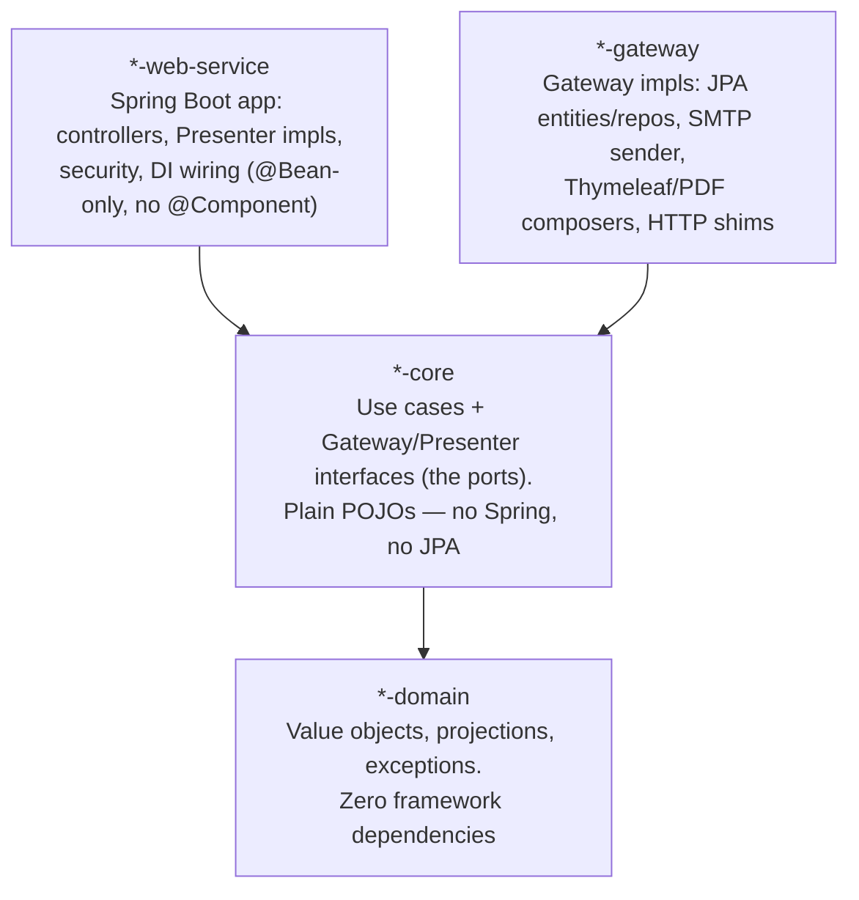
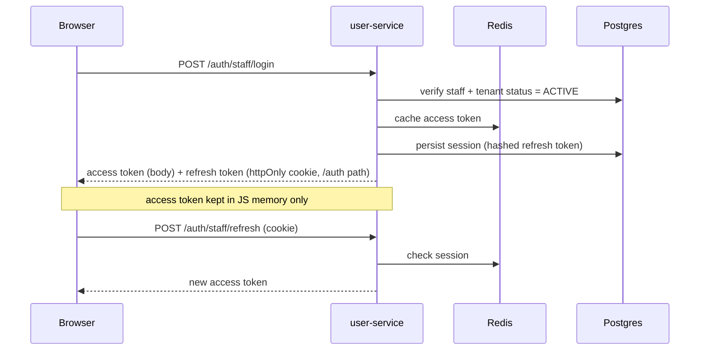
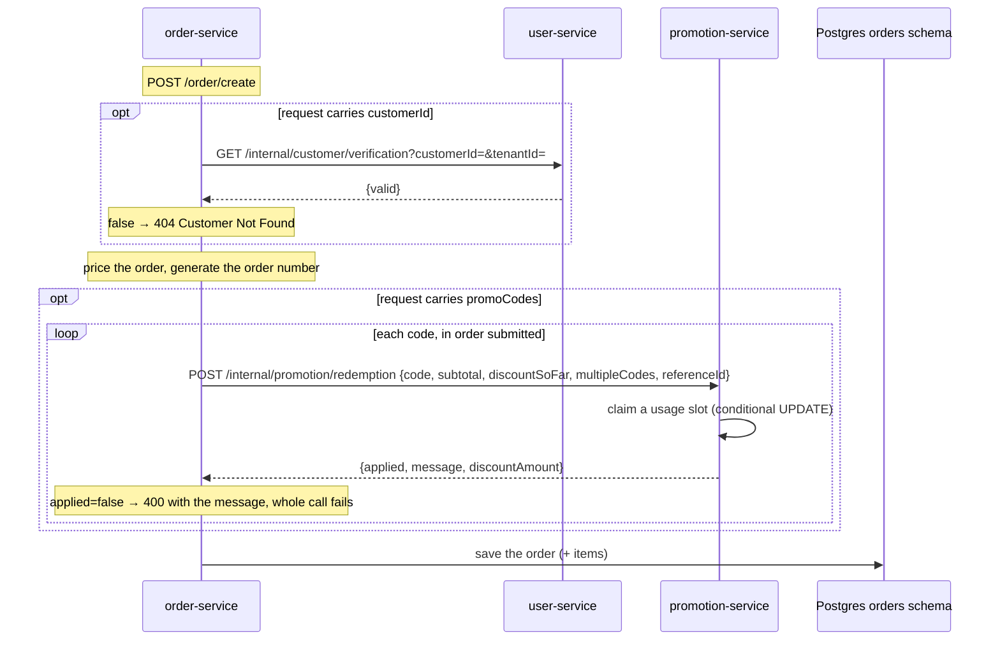
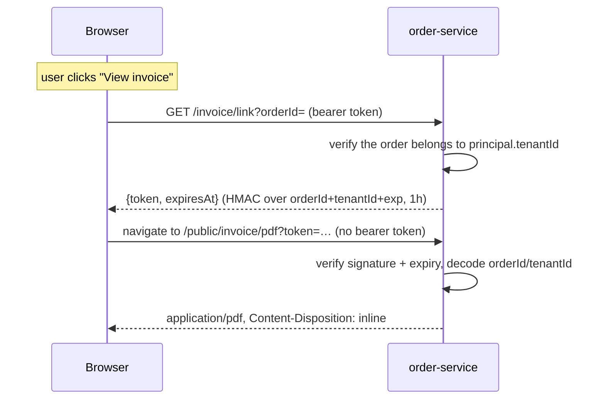
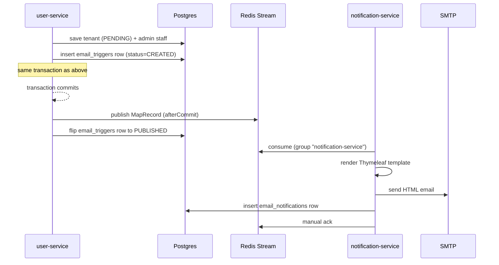
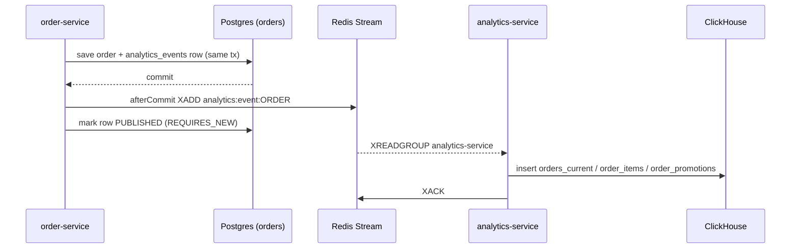

# Architecture

QLaundry is a monorepo: a React SPA, four independent Java/Spring Boot backend
services, and an nginx gateway that puts them on one origin. This document
describes the shape of the system and why it's organized this way. For
command-by-command specifics (build commands, ESLint gotchas, test
conventions, code style), see the root [`CLAUDE.md`](CLAUDE.md) and
[`web/CLAUDE.md`](web/CLAUDE.md) — this file is the map, those are the manual.

## System overview



- **One entry point.** The browser only ever talks to nginx on `:8100`. Only
  HTTPS is actually served there; a `stream`-level check redirects plain
  HTTP on the same port to `https://` before it reaches the app (see the
  invoice PDF section below), so `http://` and `https://` both land in the
  same place. It proxies `/api/*` **per resource**
  to the owning service — stripping the prefix, so Spring controllers keep
  mapping `/auth/...`, `/order/...`, `/promotion/...` — and everything else,
  including HMR websockets, to the Vite dev server. Frontend and backend are
  same-origin, so there's no CORS in dev.
- **`notification-service` has no REST endpoints and is not behind the
  gateway.** It is a pure Redis Streams consumer — see
  [Email flow](#email-flow-tenant-registration-example) below.
- **Shared infra, independent services.** The four Postgres-backed services
  point at the same local Postgres but own **disjoint schemas** (`users`,
  `orders`, `promotions`, `notif`) — there is no cross-service database
  access, ever. `order-service` uses Redis only to publish analytics events;
  `promotion-service` uses it only to resolve internal API keys.
  `analytics-service` has **no Postgres at all** — its store is ClickHouse,
  rebuildable from order-service's rows at any time.
- **Two kinds of inter-service traffic, and they're chosen deliberately.**
  Anything that can be asynchronous goes over a Redis stream (email, analytics). Anything
  the caller must have an answer to *before* it can commit goes over a
  synchronous `/internal/**` HTTP call (customer verification, promo
  redemption). See [Service-to-service calls](#service-to-service-calls).
- Every screen has a backend now — the dashboard and reports pages read
  `analytics-service` (see [OLTP → OLAP](#oltp--olap-analytics-events)), and
  the last frontend mock is gone. `promotion-service` is the reverse case — a
  backend with no frontend yet.

## Backend: Clean Architecture, one Maven module per layer

Every backend service is split into four Maven modules that map directly onto
Clean Architecture rings, wired together by one root reactor `pom.xml`:



Dependencies point inward: `web-service` and `gateway` both depend on `core`,
`core` depends only on `domain`, and `domain` depends on nothing. `core` never
imports Spring or JPA — it defines *interfaces* (`XxxGateway`, `XxxPresenter`,
`XxxComposer`) that the outer rings implement.

**A fifth module appears when a service exposes `/internal/**`:** a thin
`*-client` (`user-client`, `promotion-client`) publishing that service's
service-to-service contract as an interface plus DTOs. Consumers depend on the
client module, never hand-roll the HTTP call. See
[Service-to-service calls](#service-to-service-calls).

### The six-file feature shape

Every feature (e.g. `staff/login`, `order/confirm`, `promotion/create`) is the
same six files split across `*-core` and its adapters:

| File | Lives in | Role |
|---|---|---|
| `XxxUseCase` | `*-core` | interface — `void execute(XxxRequest, XxxPresenter)` |
| `DefaultXxxUseCase` | `*-core` | the logic — plain POJO, depends only on interfaces |
| `XxxRequest` / `XxxResponse` | `*-core` | records |
| `XxxGateway` | `*-core` (interface) → `*-gateway` (`XxxJpaGateway` impl) | persistence port |
| `XxxPresenter` | `*-core` (interface) → `*-web-service` (`XxxWebPresenter` impl) | turns the response into a transport reply (`ResponseEntity`, cookies, ...) |

Controllers stay thin: build a `XxxWebPresenter`, call
`useCase.execute(request, principal, presenter)`, return
`presenter.getResponseEntity()`. There are no `@Service`/`@Component`
annotations on use cases or gateways — every bean is wired explicitly in each
service's web config (`UserWebConfig`, `OrderWebConfig`, `PromotionWebConfig`,
`NotificationWebConfig`).

**Duplication between sibling features is the design, not an oversight.** The
seven order status transitions each own a full six-file slice with nothing
shared between them, even though their bodies are identical today — each is
expected to grow its own flow (notifications, payment gates, delivery
hand-off), and when it does it must be editable in one file without touching
the other six.

### Feature inventory

```
user-service (user-core/.../core)
├── staff/     login · logout · registration · list · detail · delete · update
│              refreshtoken · forgotpassword · submitotp · resetpassword
├── tenant/    registration · confirmregistration · resendconfirmation · expiration
├── customer/  registration · list · detail · update · delete · verification (internal)
└── notification/   (UserEmailPublisher port — see email flow)

order-service (order-core/.../core)
├── service/   create · list · update · delete          (the per-tenant price list)
├── order/     create · list · detail · payment · schedule
│              confirm · pickup · process · ready · deliver · complete · cancel
├── invoice/   link (mint a presigned URL) · pdf (render it)
└── analytics/ sweep (republish the outbox) · backfill (replay every row)

analytics-service (analytics-core/.../core)
├── event/     order · laundryservice              (stream consumers → ClickHouse upsert)
├── dashboard/ summary
└── report/    period trend + service breakdown

promotion-service (promotion-core/.../core)
└── promotion/ create · list · detail · update · toggle · redemption (internal)

notification-service (notification-core/.../core)
└── email/
    ├── tenantregistration/   renders + sends the confirmation email
    ├── forgottenpassword/    renders + sends the OTP email
    ├── send/                 EmailSendUseCase — SMTP send port
    └── history/              persists sent emails to email_notifications
```

Every `Default*UseCase` above has a matching `*UseCaseTest` (JUnit 5 +
Mockito + AssertJ soft assertions) in its module's `src/test`. There is no
untested use case in the backend; a new one ships with its test in the same
change.

### Data layer: fixed small-enum columns are lookup tables

Any column with a small closed set of values (tenant status, staff role,
session type, email trigger type/status, email type, order status/priority,
payment method/status, clothing type, service unit/category, promotion type)
is a real FK to its own tiny table, never a plain `VARCHAR`/`@Enumerated`
column. The domain-layer enum carries the numeric id (`short value` +
`fromValue(short)`); the owning JPA entity has both the real
`@ManyToOne(LAZY)` relation *and* a shadow `insertable = false,
updatable = false` id column, so the domain can be reconstructed from the raw
id without forcing the lazy proxy to load. Lookup rows are seeded via each
service's `init.sql`, not Flyway. JPA otherwise runs with `ddl-auto: update` —
no migration tool, `sql/migration.sql` is reference documentation only.

Lookup ids are **never renumbered or recycled**: rows point at them.

IDs are ULIDs (`utils/identity-generator`'s `UlidGenerator`), generated by the
gateway, never DB-generated. Order numbers are separate and human-facing:
`INV-<yyyyMMdd Asia/Jakarta>-<6 Crockford chars>`, unique-constrained.

### Money vs measurements

Money is `BigDecimal` behind a `Money` value object, normalised to 2
decimals with `HALF_EVEN` (banker's rounding, so repeated roundings don't
drift upward), stored as `NUMERIC(19,2)`. IDR has no minor unit today, but a
percentage discount or a split bill produces fractions that must not be
silently rounded away mid-calculation.

Anything *measured* rather than exact — `orders.weight_kg`,
`laundry_services.express_multiplier`, `promotions.percentage` — is a plain
`double` pinned to 2 decimals via `Decimals.scaled(...)`. The multiplication
into a price always happens in `BigDecimal`, so no amount is ever a binary
float approximation.

### Cursor pagination

List endpoints are cursor-paginated, not offset-paginated, through the shared
`utils/pagination-tools`: `PageCursor`/`CursorCodec` (opaque encode/decode),
`PageDirection`, `SortBy`/`SortDirection`, `CursorFetch<T>` (a page of rows +
a `hasMore` flag the gateway returns) and `CursorPaginator`/`CursorPage`.

The gateway fetches `PAGE_SIZE + 1` rows with a keyset predicate
(`id > cursor` / `(name, id) > (cursor.sortValue, cursor.id)`); the use case
turns `hasMore` plus the requested direction into `nextCursor`/`prevCursor`.
`hasMore` alone is never enough — which cursor it implies depends on whether
the caller asked for `NEXT` or `PREV`.

## Auth model

RS256 JWT access tokens, short-lived, cached in Redis. Opaque refresh tokens,
hashed, session persisted in Postgres (`UserSession`) and mirrored in
Redis with a capped TTL. Passwords hashed with Argon2 (`password4j`) and kept
in their own `staff_passwords` history table — `staffs` has no password
column, and a 90-day reuse window is enforced on every change.



**Only `user-service` can mint a token.** `order-service` and
`promotion-service` hold just the *public* half of the RS256 key pair
(`app.token.public-key`) and are verify-only: their JWT filters rebuild a
principal from the claims and have no `/auth` endpoints at all. Each
duplicates `StaffRole`/`SessionType` and its own `*AuthPrincipal` into its
`*-domain` module — the same duplication policy as the stream message records,
and the copies must be kept in step with `user-domain`.

A newly registered tenant starts `PENDING` and login is rejected for any of
its staff — with the same generic "Incorrect username or password" message as
a bad password — until `/auth/tenant/confirmRegistration` flips it to
`ACTIVE`. A `TenantExpirationScheduler` (daily, 03:00) sweeps tenants still
`PENDING` after 30 days: marks the tenant deleted and clears its staff's
`username` (nullable-but-unique, so the username becomes reusable) in one
transaction.

### Two path prefixes carry the auth posture

An endpoint's reachability is readable from its URL, not from a matcher array
buried in a config file:

| Prefix | Who can reach it | Enforced by |
|---|---|---|
| `/public/**` | anyone, no bearer token | `.requestMatchers("/public/**").permitAll()` — the prefix, never a list of exact paths |
| `/internal/**` | another backend service, with a versioned API key | an `PromotionInternalApiKeyAuthenticationFilter` that **returns early on any other path**, so a leaked key reaches nothing else |
| everything else | an authenticated staff principal | `anyRequest().authenticated()` |

Both rules cut both ways: anything mapped under `/public/` **is**
unauthenticated (never route something there that needs a principal), and
nothing public may live outside it. `/internal/**` is never proxied by the
gateway — `nginx.conf` maps only `/api/*` — so those endpoints are unreachable
from a browser.

> **Current status:** `order-service` and `promotion-service` follow the
> `/public/` rule. `user-service` does **not** yet — `UserSecurityConfig`
> still permits an array of nine exact `/auth/*` paths. Migrating it is not a
> rename: the `refresh_token` cookie is path-scoped to `/auth` and nginx does
> `proxy_cookie_path /auth /api/auth`, so the cookie path, that rewrite, and
> every path in the frontend's `AuthRepository` have to move together.

## PII encryption at rest

PII columns are AES-256-GCM encrypted, with the crypto confined to the
**gateway ring** — the domain and core rings only ever see plaintext, and no
use case, controller or test knows encryption exists.

- **Wire format** `<keyId>:<base64url(nonce || ciphertext || tag)>`, so
  rotation is "add `v2` to the key map, flip the active id, keep `v1` for old
  rows". Decryption looks the key up by the prefix and never consults the
  active id.
- **Per-row AAD** binds every ciphertext to `<table>:<column>:<parent id>`.
  Moving a ciphertext to another row, column or table makes it undecryptable —
  which is a feature, and also means a row's parent id can never change
  without a decrypt/re-encrypt pass.
- **Blind indexes** (HMAC-SHA256 under a separate key, lowercase hex) are what
  make lookup-by-value work: GCM is non-deterministic, so a JPQL predicate
  comparing an encrypted column to a value can never match. Match on the
  `*_hash` column, never the cipher column.
- **The entity `construct(...)` methods are the choke point.** The field is
  renamed `xxxCipher` with `@Column(name = "<original>")`, so the compiler
  walks you to every read/write site that owes an encrypt or decrypt.
- **Each service has its own independent key set** — no service ever reads
  another's rows. `user-service` reads its active key id from Redis on every
  write, so rotation needs no restart; the others use a static yaml id.

`promotion-service` stores no PII (codes, amounts, ids) and therefore has no
crypto config, no `CryptoTool` bean, and nothing to backfill.

## Service-to-service calls

`order-service` is the only service that calls others synchronously, and it
does so through exactly two endpoints — one per callee, both under
`/internal/`, neither reachable from the browser.



- **The `/internal/` prefix is what bounds the key.** The filter returns early
  on any other URI, so presenting the key on `/customer/detail` does nothing.
  Making the filter path-agnostic would turn it into a master credential.
- **Auth is a versioned per-caller secret, not a staff token.** The caller
  sends `X-Internal-Api-Key: <clientId>:<version>:<secret>`; the callee
  resolves the expected digest and compares it in constant time, then
  authenticates *as the caller* (principal `order`, authority `SERVICE_ORDER`)
  so endpoints can be scoped per service.
- **The callee stores only `SHA-256(secret)`**, never the secret, and reads it
  live from Redis (`user:internal:key:…` / `promotion:internal:key:…`) on every
  call — no cache, so a `DEL` revokes instantly. Only an actual connection
  failure falls back to the yaml map. **Consequence:** anything in yaml can't
  be revoked without a redeploy, so keep only the baseline version there.
- **Each callee keeps its own digest set**, and `order-service` holds one
  credential per callee. Rotating one never touches the other; collapsing them
  into a shared secret would make a leak in either direction reach both.
- **A trace id rides along.** `utils/http-client` puts `X-Trace-Id` on every
  request; each callee's filter lifts it into SLF4J's MDC for the duration,
  and every service's log4j2 pattern prints `%X{traceId}`. Grep one id across
  both log files to follow a call end to end.
- **The caller's principal is deliberately not forwarded as headers.** Those
  would be unsigned, so they could never be a security control. Where an
  `/internal/` endpoint *writes* and needs a real staff id for
  `created_by`/`updated_by` — the promo redemption does — it takes it as an
  explicit body field, used for audit columns only and never authorized on.
- **Both fail closed.** A non-200, a transport error or an interrupt becomes a
  503, never "assume valid" — a silent pass would let one tenant attach
  another tenant's customer to an order.

## Ordering, pricing and promotions

Pricing is computed server-side and never trusted from the client.

1. `LaundryService.priceFor(quantity, weightKg, priority)` multiplies
   `pricePerUnit` by the weight (per-kg services) or the quantity, then by
   `expressMultiplier` for `EXPRESS` orders → **subtotal**.
2. The manual `discount` a staff member grants is subtracted;
   `Money.minus` rejects a discount larger than the subtotal.
3. If `promoCodes` was supplied, each code is redeemed in turn against
   `promotion-service` and `Order.applyPromotionDiscount(...)` folds its
   granted amount in *on top of* the manual discount and every code redeemed
   before it, before the next code is redeemed — so a later code's cap
   (`discountRoom()`) already reflects everything applied so far.

`orders.discount` stays the **combined total**, so `total_price = subtotal −
discount` holds unchanged and nothing that reads a total had to move. What
each individual code granted is a row in **`order_promotions`**, a child table
of `orders` in the same parent+child shape as `order_items` — not columns on
the order. The API is many-valued end to end: `promoCodes` on the request,
`promotions: [{promotionId, code, discountAmount}]` on the response.
`order_promotions.code` is a snapshot, since promotion-service may rename or
retire the promotion afterwards.

Whether a code's own discount is computed off the *remaining* amount (after
earlier codes on the same order) or off the *original* subtotal depends on its
`PromotionType`: `PERCENTAGE` and `FIXED_AMOUNT` chain off the remainder;
`NON_CUMULATIVE_PERCENTAGE` always uses the original subtotal. A promotion
flagged `combinable = false` can only be redeemed alone — submitting it
alongside any other code rejects the whole `/order/create` call.

**Orders snapshot what they were raised with** — the customer's name, phone,
email and address, and the service's name, unit and unit price are copied onto
the order row. An invoice must keep the details it was raised with, and this
is also what avoids a cross-service call on every list. `customer_id`,
`tenant_id` and `promotion_id` are plain `varchar` columns pointing at rows in
other services' schemas — never foreign keys.

### Promotion types and the usage limit

A promotion is one of `PERCENTAGE`, `FIXED_AMOUNT` or
`NON_CUMULATIVE_PERCENTAGE`; the type decides which of `percentage` and
`amount` are required, enforced in `Promotion`'s compact constructor.
`maxDiscountAmount` (caps the grant) and `minSubtotal` (eligibility floor) are
optional on every type now, and `combinable` (default `true`) gates whether a
code can be stacked with others on the same order.
`discountFor(initialSubtotal, discountSoFar)` is the only place a discount is
computed, and it always ends `.min(basis)`. `basis` is the order's original
subtotal for `NON_CUMULATIVE_PERCENTAGE`, or `initialSubtotal − discountSoFar`
(whatever earlier codes on the same order already granted) for `PERCENTAGE`
and `FIXED_AMOUNT` — that chaining is the entire difference the type name
refers to.

Two mechanisms make "limited usage" actually hold under concurrency:

- **The limit is enforced by a conditional `UPDATE`, never read-then-write.**
  `set used_count = used_count + 1 where … and (usage_limit is null or
  used_count < usage_limit)`, and the gateway returns `rowsUpdated > 0`. Two
  orders racing for the last slot cannot both come back with one row.
- **`promotion_redemptions` is the idempotency key.** Every successful
  redemption writes a row carrying `reference_id` — the *order number* — and
  `code`, under `UNIQUE (tenant_id, reference_id, code)`, and the use case
  looks that row up *first*, keyed on the pair. A retried `/order/create`
  replays each code's first redemption instead of burning a second slot; the
  pair is what lets several codes be stacked on one order in the first place.

A code that is unknown, inactive, not yet started, expired or exhausted comes
back as `applied: false` plus a `PromotionRejection` message — never an HTTP
error. Only `order-service` turns that into a 400 for the staff member. This
mirrors how customer verification answers a yes/no rather than a 404.

## Invoice flow (presigned link)

An invoice PDF is fetched by the **browser's own navigation**, modelled on an
S3 presigned URL — no blob, no `<a download>`, no embedded viewer. A
navigation cannot carry an `Authorization` header, so the auth moves into the
URL as a signed, expiring token, and the tenant id travels *inside* the
signature so the endpoint stays tenant-scoped.



- Signing is **not** invoice-specific: `utils/link-signer` is a generic
  reusable module (`sign(expiresAt, Map<String,String>)` /
  `verify(token) → Optional<SignedLinkPayload>`), constant-time verified,
  fields keyed by name rather than position. Any future presigned-link feature
  is a new consumer of it, not a copy.
- The token is **self-contained** — nothing is stored server-side, so rotating
  the secret invalidates every outstanding link at once.
- **Verifying is the use case's job, not the controller's.** The controller
  just wraps the raw token in a request; `DefaultInvoicePdfUseCase` takes the
  `LinkSigner` as a dependency and decodes the ids itself. There is no
  principal on that path at all — tampering with either id breaks the HMAC.
- The two halves sit on **different prefixes on purpose**: minting is
  authenticated at `/invoice/link`, rendering is public at
  `/public/invoice/pdf`. Moving the mint endpoint under `/public/` would let
  anyone forge a link for any order id.
- Rendering follows the same Composer-port pattern as the emails, one ring
  over: core defines `InvoiceComposer`, and only the gateway ring imports
  Thymeleaf, jsoup and openhtmltopdf.

> **Dev-only gotcha, measured not guessed:** a download manager (IDM) with
> socket-level browser integration hijacks the PDF over plain HTTP because it
> reads `Content-Type` off the cleartext socket. It cannot see inside TLS.
> The gateway used to publish a plain-HTTP `:8100` alongside a TLS `:8443` as
> an opt-in escape hatch for this. Now only `8100:443` is published, and a
> `stream`-level `ssl_preread` check 301-redirects any plain HTTP request on
> that port to `https://` before it reaches the app — so the hijack never
> happens by default, whichever scheme someone types. Nothing is wrong with
> the response headers, and production terminates TLS. Don't "fix" this by
> mislabelling the media type or dropping `Content-Disposition`.

## Email flow (tenant-registration example)

`notification-service` never receives an HTTP call — `user-service` produces
a job, `notification-service` consumes it asynchronously via Redis Streams
(one stream per `EmailTriggerType`, `notification:email:<TYPE>`).



- The producer writes an **outbox row** (`email_triggers`) inside the same
  transaction as the business write, and only publishes to Redis
  `afterCommit` — so a stream message never points at data that isn't
  committed yet. A publish failure is logged and swallowed (row stays
  `CREATED`; there's no retry job yet).
- The stream record carries `triggerId`, `type`, `recipient`, `payload`
  (JSON) — the payload shape (e.g. `TenantRegistrationEmailMessage`) is a
  record duplicated on both sides of the stream and must be kept in sync
  manually.
- The consumer acks manually, only after the email is sent and persisted —
  failures stay pending on the consumer group rather than being silently
  dropped.
- **The subscription survives an outage.** It is registered with an explicit
  `cancelOnError(_ -> false)`; the default predicate cancels the subscription
  on the *first* poll error, leaving the consumer dead even after Lettuce
  reconnects. The error handler also recreates consumer groups on `NOGROUP`.
- **Redis Streams never expire entries by age** — `XACK` only clears the
  group's PEL. A daily `EmailStreamTrimScheduler` issues `XTRIM … MINID` using
  a retention cutoff (7 days). The durable record is the encrypted
  `email_triggers` row, not the stream entry.
- The confirmation link the email sends the user to points at the
  **frontend's** origin (`/confirm-registration?tenantId=&token=`), which
  then calls back into `user-service` itself.
- Stream listeners **never log recipients** (PII) — trigger ids only.

## OLTP → OLAP (analytics events)

The dashboard numbers come from ClickHouse, fed by the same outbox shape as
the email flow above, one ring over.



- **Events are full-state snapshots**, not deltas: the whole row plus its JPA
  `@Version`. ClickHouse's `ReplacingMergeTree(version)` keeps the highest
  version per key, so a replayed, duplicated or out-of-order event can't
  corrupt anything, and reads use `FINAL` on a tenant-filtered query.
- **Unlike the email outbox, this one has a retry job**: a 5-minute sweeper
  republishes rows still `CREATED` two minutes after they were written — a
  missing analytics row is a wrong number on a screen forever.
- **No PII leaves order-service**: the payload carries `customer_id` only, no
  name/phone/email/address, no notes. That is why the dashboard's "today's
  schedule" (which shows customer names) is `GET /order/schedule` in
  order-service, not an analytics endpoint.
- A record that fails five deliveries moves to
  `analytics:event:<AGGREGATE>:dlq`; a per-minute reclaim job re-runs anything
  idle in the PEL. Streams and DLQs are trimmed daily after 7 days.
- ClickHouse is rebuildable: run order-service with the `analytics-backfill`
  profile and every row is replayed through the same outbox. Runbook:
  `analytics-service/analytics-gateway/sql/reconcile.md`.

## Frontend architecture

`web/` is React 19 + TypeScript 6 + Vite, using screaming + clean
architecture: every feature is a self-contained vertical slice under
`src/features/<feature>/`.

```
src/features/<feature>/
├── domain/          pure types & repository interfaces (zero deps)
├── infrastructure/  repository implementations: API call → map the wire format
├── application/     use cases (thin orchestration, no React)
└── presentation/    React hooks (use*) + page components
```

Features today: `auth`, `staff`, `orders`, `customers`, `dashboard`,
`reports`. Cross-feature code lives in `src/core/` (ui, theme, http, auth,
config, utils) and `src/shared/` (Sidebar, Topbar).

Every feature calls its backend live-only and propagates errors to the UI.
The old `withFallback(live, fallback)` seam — bundled mock data for screens
whose backend didn't exist yet — was deleted together with its last caller,
the dashboard, once `analytics-service` landed.

The access token lives only in JS memory; session survives a reload via the
`refresh_token` httpOnly cookie. See `web/CLAUDE.md` for the full state/auth
notes, ESLint gotchas, and styling conventions.

## Utils modules

Shared, framework-light libraries consumed by the backend services
(`groupId com.ferry.utils` / `com.ferry.common`):

| Module | Provides |
|---|---|
| `identity-generator` | `UlidGenerator` (implements `IdGenerator`) |
| `cache-tools` | `CacheHandler`/`DefaultCacheHandler` over `StringRedisTemplate` |
| `token-manager` | JWT generate/parse (`TokenGenerator`/`TokenParser`) |
| `json-tools` | `JsonManager` wrapping Jackson `ObjectMapper` |
| `internal-commons` | `CrockfordBase32` (used by ULID generation) · `EnumParser` (lenient name→enum lookup, used by every JWT filter) |
| `crypto-tools` | `CryptoTool`/`AesGcmCryptoTool` — AES-256-GCM field encryption + HMAC blind index, JDK-only |
| `pagination-tools` | cursor pagination primitives shared by every list use case |
| `http-client` | fluent JDK `HttpClient` wrapper with automatic trace-id propagation |
| `link-signer` | `LinkSigner`/`HmacLinkSigner` — generic HMAC-signed, expiring, self-contained link tokens |

Plus the per-service client modules (`user-client`, `promotion-client`), which
are not utils but follow the same "publish a contract, hide the transport"
shape.

## Why it's built this way

- **Clean Architecture per service, not a shared monolith module.** Each
  service's `core` module has zero Spring/JPA dependency, so use-case logic
  is testable with plain JUnit + Mockito and unaware of transport or
  persistence concerns. The tradeoff is more files per feature (six, always)
  in exchange for every feature looking identical regardless of who wrote it.
- **Four services, split along failure boundaries rather than by entity size.**
  `notification-service` is isolated behind Redis Streams rather than called
  synchronously, so a slow or down SMTP server can never make tenant
  registration or a password reset fail — the outbox + afterCommit publish
  means the worst case is a delayed email. `promotion-service` is separate
  because promo rules churn on their own schedule and its outage should cost
  you promo codes, not orders.
- **Customers live in `user-service`, not `order-service`.** They are
  accounts-in-waiting (a self-service customer login is the reason
  `customers.tenant_id` is nullable), and keeping their PII in one service
  means one key set and one blind-index scheme to reason about. `order-service`
  holds an id plus an immutable snapshot and never reads that schema.
- **Synchronous only where a decision must precede a commit.** Verifying a
  customer and claiming a promo slot both change what gets written, so they
  can't be fire-and-forget; everything else that crosses a boundary is a
  stream message.
- **Path prefixes as the security contract.** `/public/` and `/internal/`
  make an endpoint's reachability obvious from its URL and let the security
  config match on a prefix instead of an ever-growing list of exact paths that
  nobody re-reads.
- **nginx gateway in front of every dev server.** Keeping the browser on one
  origin sidesteps CORS entirely and matches how this will sit behind a
  reverse proxy in production, so dev and prod topology stay close. Routing is
  per-resource rather than one blanket `/api/` → one upstream, so a service
  can be moved without rewriting every client path.
- **`withFallback` on the frontend.** It let the whole SPA — including screens
  with no backend yet — be built, demoed and unit-tested against realistic
  data without blocking on backend sequencing, and what still uses it is an
  honest to-do list.
